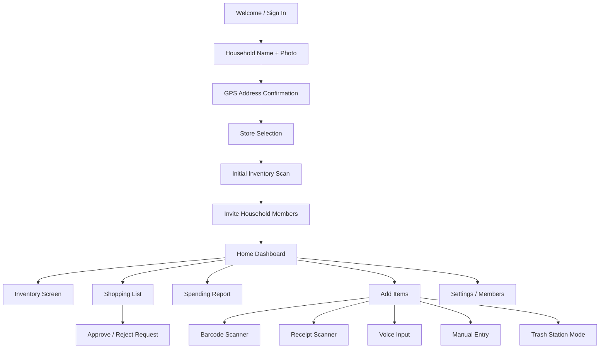

# Routes / Screens

Mekasa has no React Router / Next.js routes. Navigation is defined in `design/user-flows.md`
and implemented later in native apps. Design mockup files map to screens as follows:

| Screen | Mockup file | Spec | Notes |
|--------|-------------|------|-------|
| Home Dashboard | `design/mockups/Dashboard.jsx` | UI-001 | Hub after onboarding |
| Onboarding Store Selection | `design/mockups/OnboardingStoreSelection.jsx` | UI-002 | Part of onboarding |
| Shopping List | `design/mockups/ShoppingList.jsx` | UI-003 | From dashboard |
| Add Items | `design/mockups/AddItems.jsx` | UI-004 | Hub for scan/voice/manual/trash |
| Trash Station Mode | `design/mockups/TrashStationMode.jsx` | UI-005 | From Add Items |

## Full onboarding + app flow (from `design/user-flows.md`)

Screens without mockup files yet: Welcome, HouseholdSetup, AddressConfirm, InitialScan,
InviteMembers, InventoryScreen, SpendingReport, Settings, BarcodeScanner, ReceiptScanner,
VoiceInput, ManualEntry, RequestApproval.
