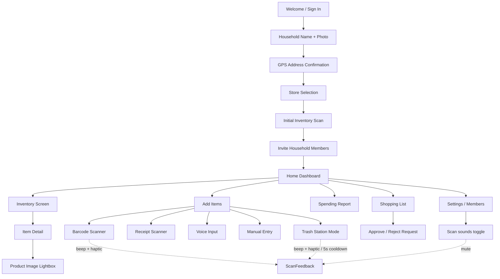

# Mekasa User Flows (v1.0)

Screen-to-screen navigation for Mekasa v1.0.

**Scan feedback:** accepted barcodes play `design/scanner-beep.mp3` plus haptic/vibrate; unknown lookups use a nack tone. Family / Settings → **Scan sounds** (default on) mutes both. Trash station also enforces a 5-second cooldown after each accepted scan.
