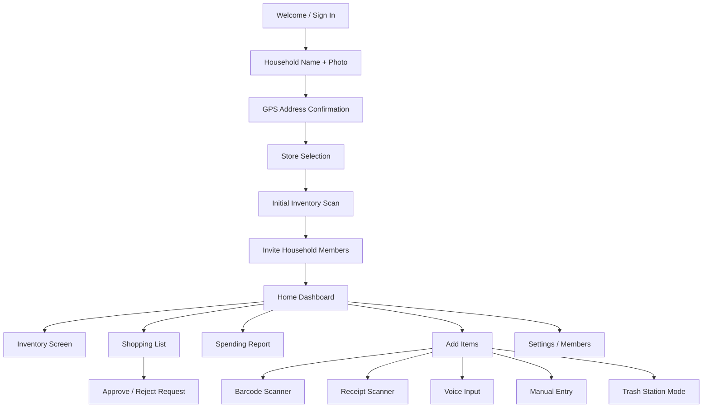

# Mekasa User Flows (v1.0)

Screen-to-screen navigation for Mekasa v1.0.

```mermaid
flowchart TD
  Welcome[Welcome / Sign In] --> HouseholdSetup[Household Name + Photo]
  HouseholdSetup --> AddressConfirm[GPS Address Confirmation]
  AddressConfirm --> StoreSelection[Store Selection]
  StoreSelection --> InitialScan[Initial Inventory Scan]
  InitialScan --> InviteMembers[Invite Household Members]
  InviteMembers --> Dashboard[Home Dashboard]

  Dashboard --> InventoryScreen[Inventory Screen]
  Dashboard --> ShoppingList[Shopping List]
  Dashboard --> SpendingReport[Spending Report]
  Dashboard --> AddItems[Add Items]
  Dashboard --> Settings[Settings / Members]

  AddItems --> BarcodeScanner[Barcode Scanner]
  AddItems --> ReceiptScanner[Receipt Scanner]
  AddItems --> VoiceInput[Voice Input]
  AddItems --> ManualEntry[Manual Entry]
  AddItems --> TrashStation[Trash Station Mode]

  ShoppingList --> RequestApproval[Approve / Reject Request]
```
