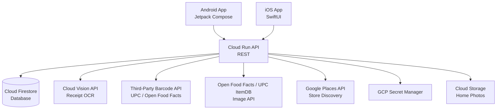

# MEKASA — Architecture Document v1.0

## 1. System Overview
Mekasa consists of two native mobile clients (Android/Jetpack Compose
and iOS/SwiftUI), a GCP-based backend REST API served via Cloud Run,
and a real-time sync layer via Cloud Firestore. All clients communicate
through the same API, making future desktop clients straightforward
to add without any SDK dependency changes.

---

## 2. Component Diagram

---

## 3. Data Flows

### Barcode Scan Flow
Mobile client captures barcode → sends UPC to API → API queries
third-party barcode database (Open Food Facts primary) → returns
product name, category, estimated price, and `image_url` → client
confirms → API writes item + image URL to Firestore → real-time
sync pushes to all household devices → inventory list shows
thumbnail; item detail shows large image (tap to enlarge)

### Inventory Browse Flow
Dashboard / Inventory Screen shows rows with product thumbnails
(from stored `image_url` or category placeholder) → user taps row
→ Item Detail shows large product image, name, category, UPC,
quantity, and low-stock threshold → tap image opens full-screen
lightbox → back returns to list

### Receipt Scan Flow
Mobile client captures receipt image → uploads to Cloud Storage →
API triggers Cloud Vision OCR → returns parsed line items →
client presents for user review → confirmed items written to
Firestore → sync pushes to all household devices

### Trash Station Flow
Dedicated device scans barcode → sends to API → API decrements
quantity for matching household item → if below threshold,
auto-adds to shopping list → sync pushes to all household devices

### Onboarding Address + Store Flow
Client requests GPS → reverse geocode via API → present suggested
address to user → user confirms or edits → API queries Places
within 15-mile radius → returns store list → user selects
preferred stores → stored in household profile

### Request Approval Flow
Member submits request → API writes to Firestore in pending state →
Owner receives push notification → Owner approves/rejects/questions →
API updates record → sync notifies all devices → member receives
result notification

---

## 4. Security Model
- All API endpoints require JWT authentication
- Household data is scoped by household_id — cross-household access
  is impossible by design
- All secrets (API keys, DB credentials) stored in GCP Secret Manager
- No PII in application logs
- Role enforcement (Owner vs. Member) enforced server-side, not client-side

---

## 5. Architecture Decision Records (ADR)

### ADR-001: Native Mobile over Cross-Platform
Date: 2026-08-17
Status: Accepted
Decision: Build Android in Jetpack Compose and iOS in SwiftUI
rather than using a cross-platform framework like React Native
or Flutter.
Rationale: Native provides the best performance and user
experience for a scan-heavy, real-time app. Jetpack Compose
and SwiftUI are both mature, modern, and fully programmatic.
The household inventory use case benefits from tight OS
integration (camera, notifications, background sync).
Trade-off: Two separate codebases to maintain. Mitigated by
shared API contract and consistent business logic on the backend.

### ADR-002: GCP Backend over Firebase
Date: 2026-08-17
Status: Accepted
Decision: Use a custom GCP Cloud Run REST API rather than
Firebase as the primary backend.
Rationale: GCP backend is platform-agnostic — future Windows
desktop or web clients can connect without any SDK dependency.
Provides full control over business logic, pricing, and scaling.
Firestore can still be used as the database layer.
Trade-off: More initial setup than Firebase. Mitigated by
Cloud Run's simplicity and prior GCP experience from FALLOUT.

### ADR-002a: Firestore over Cloud SQL as the Database Layer
Date: 2026-09-06
Status: Accepted
Decision: Use Cloud Firestore as the primary database rather
than Cloud SQL (PostgreSQL).

Context: Mekasa stores household inventory items, receipt OCR
line items, trash station events, child request queues, store
discovery data, and family member profiles. Multiple family
members on different devices interact with the same household
data concurrently.

Options considered:

**Option A — Cloud Firestore (Document DB)**
- Real-time multi-device sync built in — all family members see
  inventory changes instantly without polling
- Offline support built in — local cache keeps the app usable
  without a connection; syncs automatically on reconnect
- Flexible document schema — receipt OCR results vary widely by
  store and format; a document model handles irregular structures
  better than rigid columns
- Native mobile SDKs with live listeners — ideal for reactive
  Jetpack Compose and SwiftUI UI patterns
- No schema migrations — new fields can be added without
  `ALTER TABLE`; supports rapid early iteration
- Already in the GCP org — no additional infrastructure, same
  billing and IAM
- Weakness: Limited ad-hoc querying — no joins, no arbitrary
  `WHERE` clauses across collections
- Weakness: Spending reports and category rollups require either
  denormalized data or aggregation via Cloud Functions

**Option B — Cloud SQL (PostgreSQL)**
- Complex queries trivial — spending reports, category rollups,
  date-range analytics are standard SQL
- Relational integrity enforced at DB level — foreign keys between
  items, receipts, and line items
- Familiar tooling — standard SQL, easy to inspect and debug
- Weakness: No real-time push — polling or a separate Pub/Sub
  layer required for live family sync; significant custom work
- Weakness: No built-in offline support — must be built separately
  or omitted
- Weakness: Schema migrations required for every new field —
  slower iteration in early development
- Weakness: Cloud SQL instance runs 24/7 even when idle — higher
  baseline cost for a household-scale app

Rationale: Real-time multi-device sync and offline support are
core requirements for Mekasa — they are what makes a household
inventory app actually usable by a family on the go. Firestore
provides both for free. Replicating them on Cloud SQL would
require significant custom engineering with no functional
advantage for this use case.

The one Firestore weakness — spending analytics — is resolved by
a Cloud Function that aggregates spending totals into a
`spending_summaries` collection on every confirmed receipt save.
Reporting screens read from this pre-aggregated collection rather
than running live queries across raw line-item documents.

Trade-off: Spending report logic requires Cloud Function
aggregation rather than live SQL queries. Acceptable given that
spending reports are low-frequency reads, not real-time views.

### ADR-003: Server-Side Receipt OCR
Date: 2026-08-17
Status: Accepted
Decision: Receipt OCR processing is done server-side via
Google Cloud Vision rather than on-device.
Rationale: Server-side OCR is significantly more accurate for
receipts, which vary widely in format, font, and print quality.
On-device ML Kit is sufficient for barcodes but not for
unstructured receipt text.
Trade-off: Requires network connectivity for receipt scanning.
Acceptable since receipt scanning is not a core offline use case.

### ADR-004: Third-Party Barcode Database
Date: 2026-08-17
Status: Accepted
Decision: Use a third-party barcode/UPC database API (e.g.,
Open Food Facts, UPC ItemDB) rather than building our own.
Rationale: Third-party databases have millions of products
already indexed. Building and maintaining our own is not
justified for v1.0. Our own database grows organically as
users scan items not found in the third-party source.
Trade-off: Dependency on third-party availability and coverage.
Mitigated by a manual entry fallback for unknown barcodes.

### ADR-005: GPS + Reverse Geocoding for Store Discovery
Date: 2026-08-17
Status: Accepted
Decision: Use device GPS plus reverse geocoding to detect home
address during onboarding, then query Google Places API within
a 15-mile radius for nearby stores.
Rationale: Eliminates manual store entry, improves price
estimation accuracy by localizing to the user's actual
shopping area, and creates a better out-of-box experience.
Trade-off: Requires location permission. Mitigated by clear
explanation during onboarding and a manual address entry
fallback if permission is denied.

### ADR-006: UPC Product Image Lookup Strategy
Date: 2026-09-08
Status: Accepted
Decision: Retrieve product images using a three-step waterfall:
(1) Open Food Facts, (2) UPC ItemDB, (3) category placeholder.
All lookups are performed server-side in the Cloud Run API.

Context: After a barcode scan, Mekasa already resolves product
name and category via a third-party UPC database (ADR-004). Users
also need a product image next to each inventory item. Image
lookup must stay on the Cloud Run API so API keys stay in Secret
Manager and waterfall retry logic is centralized—never called
directly from mobile clients.

Options considered:

**Option A — Open Food Facts**
- Free, no API key required, open source
- Best for food and grocery items (~3 million products globally)
- Returns `image_url` and `image_front_url` fields
- Endpoint: `https://world.openfoodfacts.org/api/v0/product/{barcode}.json`
- Weakness: Community-contributed photos, variable quality
- Weakness: Limited coverage for non-food household items

**Option B — UPC ItemDB**
- Free up to 100 requests/day; paid plans above that
- General retail coverage beyond food (~1.5 million products)
- Returns `items[0].images[]` array
- Weakness: 100/day free tier may be limiting at scale
- Weakness: Requires an API key (must live in GCP Secret Manager)

**Option C — Nutritionix**
- Free for modest usage
- Strong on branded US grocery items
- Includes nutrition data as a bonus
- Weakness: Food-only, not general retail

**Option D — Google Cloud Vision Web Detection**
- Already in the Mekasa GCP stack (used for receipt OCR)
- Image-first matching: user photo → similar product images on
  the web — useful when no UPC database returns an image
- Weakness: Not a UPC lookup — requires an image as input, not a
  barcode string
- Weakness: Higher per-call cost than static database lookups

Rationale: A three-step waterfall maximizes free coverage for
grocery scans while keeping a second source for non-food retail
and a deterministic UI fallback. Open Food Facts is primary
because it needs no key and will resolve most household food
scans at zero cost. UPC ItemDB is the secondary step for broader
retail coverage when Open Food Facts has no image. Category
placeholders guarantee every inventory row still shows something
useful. Cloud Vision Web Detection is deferred to a future ADR
until production coverage proves insufficient, avoiding Vision
API cost in v1.0.

Implementation Notes:
- Image lookup handler: `api/handlers/image_lookup.py`
- Category placeholder map: `api/config/category_icons.py`
- Secret name for UPC ItemDB key: `UPCITEMDB_API_KEY`
- Waterfall must be a single internal function:
  `get_product_image(upc: str, category: str) -> str`
  returning a URL in all cases — never `None` or an exception
- Add `UPCITEMDB_API_KEY` to the Secret Manager setup
  instructions in `docs/runbook.md` when that file is created
  (`docs/runbook.md` does not exist yet)

Trade-off: Two external API dependencies instead of one.
Mitigated by Open Food Facts requiring no key and UPC ItemDB
free tier being sufficient for household-scale usage.
