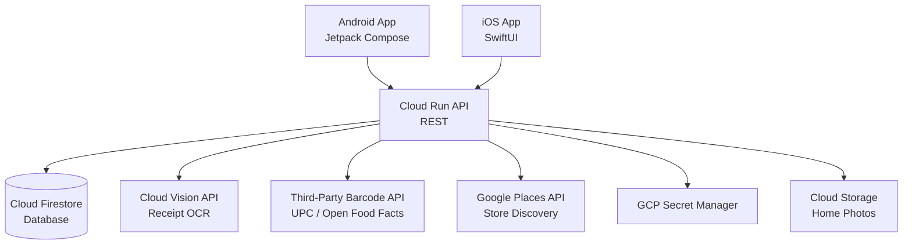

# MEKASA — Architecture Document v1.0

## 1. System Overview
Mekasa consists of two native mobile clients (Android/Jetpack Compose
and iOS/SwiftUI), a GCP-based backend REST API served via Cloud Run,
and a real-time sync layer via Cloud Firestore. All clients communicate
through the same API, making future desktop clients straightforward
to add without any SDK dependency changes.

---

## 2. Component Diagram

---

## 3. Data Flows

### Barcode Scan Flow
Mobile client captures barcode → sends UPC to API → API queries
third-party barcode database → returns product name, category,
estimated price → client confirms → API writes to Firestore →
real-time sync pushes to all household devices

### Receipt Scan Flow
Mobile client captures receipt image → uploads to Cloud Storage →
API triggers Cloud Vision OCR → returns parsed line items →
client presents for user review → confirmed items written to
Firestore → sync pushes to all household devices

### Trash Station Flow
Dedicated device scans barcode → sends to API → API decrements
quantity for matching household item → if below threshold,
auto-adds to shopping list → sync pushes to all household devices

### Onboarding Address + Store Flow
Client requests GPS → reverse geocode via API → present suggested
address to user → user confirms or edits → API queries Places
within 15-mile radius → returns store list → user selects
preferred stores → stored in household profile

### Request Approval Flow
Member submits request → API writes to Firestore in pending state →
Owner receives push notification → Owner approves/rejects/questions →
API updates record → sync notifies all devices → member receives
result notification

---

## 4. Security Model
- All API endpoints require JWT authentication
- Household data is scoped by household_id — cross-household access
  is impossible by design
- All secrets (API keys, DB credentials) stored in GCP Secret Manager
- No PII in application logs
- Role enforcement (Owner vs. Member) enforced server-side, not client-side

---

## 5. Architecture Decision Records (ADR)

### ADR-001: Native Mobile over Cross-Platform
Date: 2026-08-17
Status: Accepted
Decision: Build Android in Jetpack Compose and iOS in SwiftUI
rather than using a cross-platform framework like React Native
or Flutter.
Rationale: Native provides the best performance and user
experience for a scan-heavy, real-time app. Jetpack Compose
and SwiftUI are both mature, modern, and fully programmatic.
The household inventory use case benefits from tight OS
integration (camera, notifications, background sync).
Trade-off: Two separate codebases to maintain. Mitigated by
shared API contract and consistent business logic on the backend.

### ADR-002: GCP Backend over Firebase
Date: 2026-08-17
Status: Accepted
Decision: Use a custom GCP Cloud Run REST API rather than
Firebase as the primary backend.
Rationale: GCP backend is platform-agnostic — future Windows
desktop or web clients can connect without any SDK dependency.
Provides full control over business logic, pricing, and scaling.
Firestore can still be used as the database layer.
Trade-off: More initial setup than Firebase. Mitigated by
Cloud Run's simplicity and prior GCP experience from FALLOUT.

### ADR-003: Server-Side Receipt OCR
Date: 2026-08-17
Status: Accepted
Decision: Receipt OCR processing is done server-side via
Google Cloud Vision rather than on-device.
Rationale: Server-side OCR is significantly more accurate for
receipts, which vary widely in format, font, and print quality.
On-device ML Kit is sufficient for barcodes but not for
unstructured receipt text.
Trade-off: Requires network connectivity for receipt scanning.
Acceptable since receipt scanning is not a core offline use case.

### ADR-004: Third-Party Barcode Database
Date: 2026-08-17
Status: Accepted
Decision: Use a third-party barcode/UPC database API (e.g.,
Open Food Facts, UPC ItemDB) rather than building our own.
Rationale: Third-party databases have millions of products
already indexed. Building and maintaining our own is not
justified for v1.0. Our own database grows organically as
users scan items not found in the third-party source.
Trade-off: Dependency on third-party availability and coverage.
Mitigated by a manual entry fallback for unknown barcodes.

### ADR-005: GPS + Reverse Geocoding for Store Discovery
Date: 2026-08-17
Status: Accepted
Decision: Use device GPS plus reverse geocoding to detect home
address during onboarding, then query Google Places API within
a 15-mile radius for nearby stores.
Rationale: Eliminates manual store entry, improves price
estimation accuracy by localizing to the user's actual
shopping area, and creates a better out-of-box experience.
Trade-off: Requires location permission. Mitigated by clear
explanation during onboarding and a manual address entry
fallback if permission is denied.
